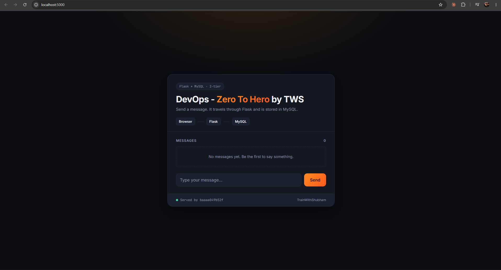
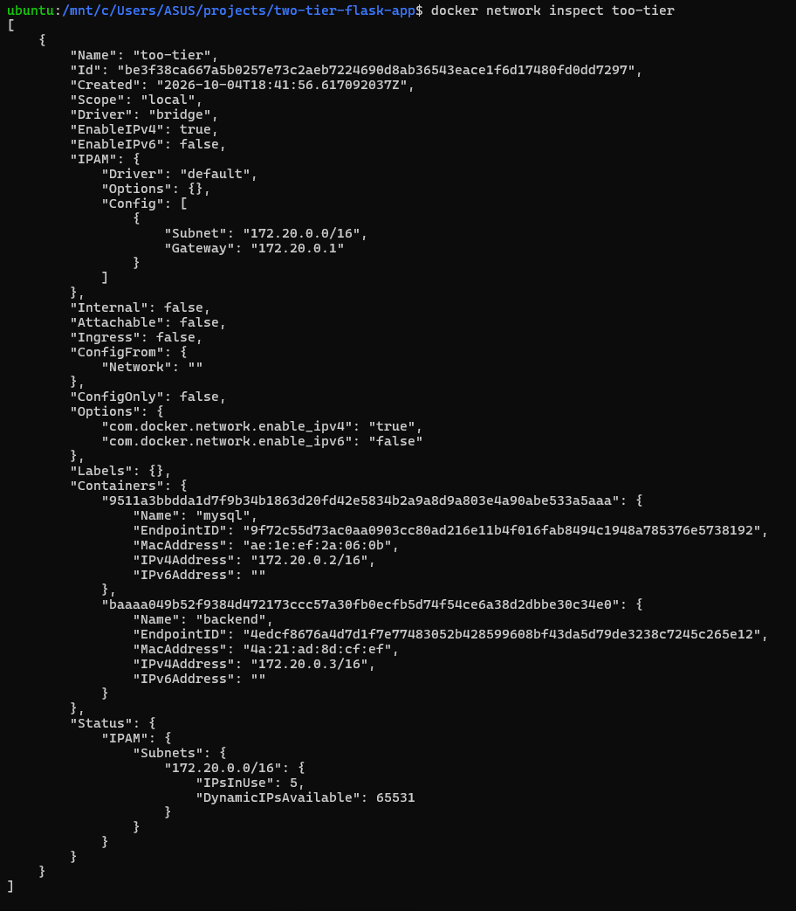
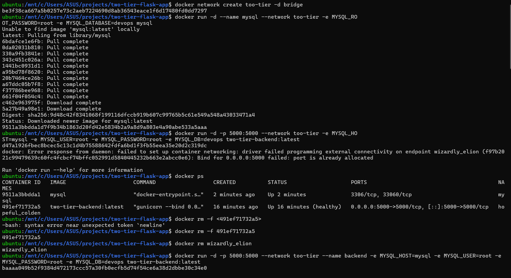
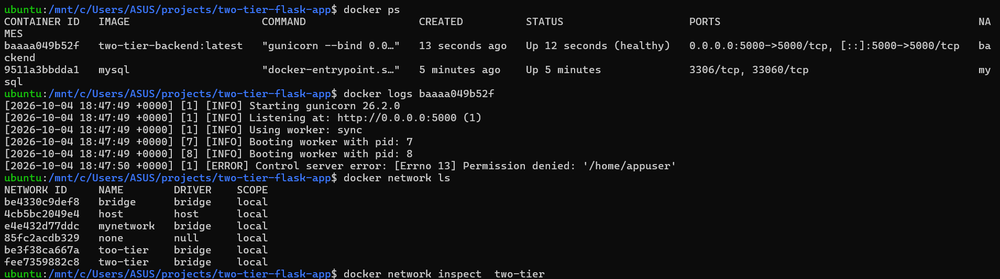

# Day 2: Docker networking with a two-tier Flask + MySQL app

I ran a Flask backend and a MySQL database as two separate containers on a custom bridge network, so the app reaches the database **by container name** instead of by IP.

> **Credit:** the app comes from [LondheShubham153/two-tier-flask-app](https://github.com/LondheShubham153/two-tier-flask-app) by Shubham Londhe (TrainWithShubham). I ran and debugged it as part of my learning.



## Architecture

```
Browser ──► localhost:5000 ──► [ backend ]  ──── "mysql:3306" ────►  [ mysql ]
                               172.20.0.3                            172.20.0.2
                         └──────────── custom bridge network: too-tier ────────────┘
```

- Only the backend publishes a port (`-p 5000:5000`). MySQL is reachable **only inside the network**, not from the host or internet.
- The backend finds the database with `MYSQL_HOST=mysql`. Docker's built-in DNS on custom networks turns the container name `mysql` into its IP.

## Commands

```bash
# 1. Build the backend image
docker build -t two-tier-backend:latest .

# 2. Create a custom bridge network
docker network create too-tier -d bridge

# 3. Start MySQL on that network
docker run -d --name mysql --network too-tier \
  -e MYSQL_ROOT_PASSWORD=root -e MYSQL_DATABASE=devops mysql

# 4. Start the backend on the same network
docker run -d -p 5000:5000 --network too-tier --name backend \
  -e MYSQL_HOST=mysql -e MYSQL_USER=root -e MYSQL_PASSWORD=root -e MYSQL_DB=devops \
  two-tier-backend:latest

# 5. Check
docker ps
docker logs backend
docker network inspect too-tier
```

Open http://localhost:5000, type a message and press Send. It goes Browser → Flask → MySQL.

> The passwords here are for local practice only. For anything real, use the `.env.example` file and strong passwords.

## Reading `docker network inspect`



| Field | Value | Meaning |
|---|---|---|
| Driver | `bridge` | Private virtual network on this one machine |
| Subnet | `172.20.0.0/16` | IP range for containers on this network |
| Gateway | `172.20.0.1` | The network's router |
| Containers | `mysql` → `.2`, `backend` → `.3` | IPs are handed out in order after the gateway |
| IPsInUse | `5` | 3 reserved (network address, gateway, broadcast) + 2 containers |

An empty network still shows `IPsInUse: 3` because of those reserved addresses.

## What went wrong, and how I fixed it



| Problem | Cause | Fix |
|---|---|---|
| `Bind for 0.0.0.0:5000 failed: port is already allocated` | An older backend container (`hopeful_colden`) from an earlier attempt was still holding port 5000 | `docker ps` to find it, then `docker rm -f <id>` |
| A leftover container `wizardly_elion` in `Created` state | The failed `docker run` still creates the container, it just can't start it | `docker rm wizardly_elion`, and always pass `--name` so containers are easy to find |
| `-bash: syntax error near unexpected token 'newline'` | I typed the `<placeholder>` brackets literally; bash treats `<` and `>` as redirection | Type only the value, without `< >` |
| `[ERROR] Control server error: Permission denied: '/home/appuser'` in the logs | The Dockerfile creates `appuser` with `--no-create-home`, so gunicorn can't write to its home folder. The app still works and is `healthy`. | Not fixed yet. Next step: create the user with a home directory (`useradd -m appuser`) |
| Two networks, `two-tier` and `too-tier` | Created one, then made a typo the second time | Remove the unused one with `docker network rm two-tier` |



## Lessons

1. Containers on a **custom** network can talk by name; the default bridge network has no name lookup.
2. `-p HOST:CONTAINER`: only the left (host) port has to be free.
3. Only publish the ports you need. The database doesn't need `-p` at all.
4. An `ERROR` line in the logs doesn't always mean the app is broken. Check `docker ps`, the health status and the browser first.
