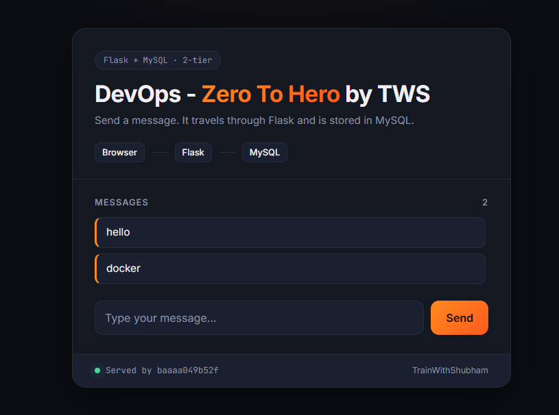
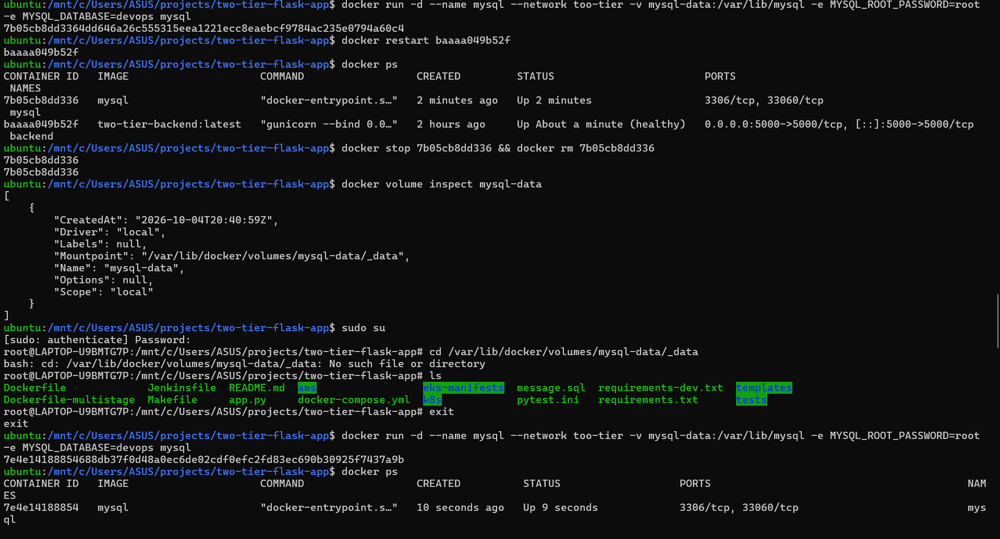
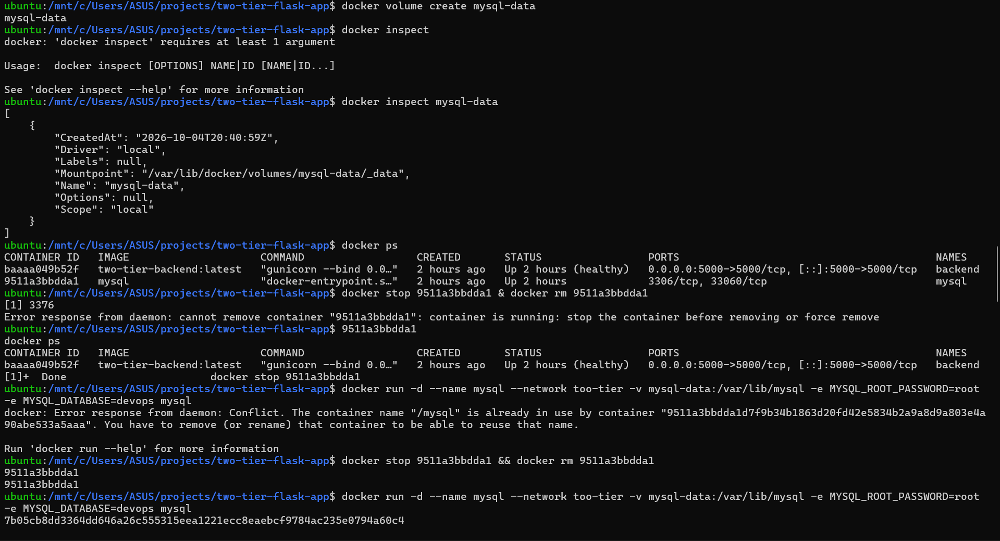

# Day 3: Docker volumes and storage

Containers are disposable: when you remove one, everything written inside it is gone. Today I made my MySQL data survive a container being deleted and recreated, using a **named volume**.

Same two-tier app as [Day 2](../day-02-docker-networking/) (Flask + MySQL on the `too-tier` network). App credit: [LondheShubham153/two-tier-flask-app](https://github.com/LondheShubham153/two-tier-flask-app) by Shubham Londhe (TrainWithShubham).



## The experiment

```bash
# 1. Create a named volume and look at it
docker volume create mysql-data
docker volume inspect mysql-data

# 2. Replace the old MySQL container (it had no volume) with one that uses the volume
docker stop mysql && docker rm mysql
docker run -d --name mysql --network too-tier \
  -v mysql-data:/var/lib/mysql \
  -e MYSQL_ROOT_PASSWORD=root -e MYSQL_DATABASE=devops mysql
docker restart backend

# 3. Open http://localhost:5000 and send a couple of messages

# 4. Delete the MySQL container completely
docker stop mysql && docker rm mysql
docker volume inspect mysql-data    # the volume is still there

# 5. Create a brand-new MySQL container with the same volume
docker run -d --name mysql --network too-tier \
  -v mysql-data:/var/lib/mysql \
  -e MYSQL_ROOT_PASSWORD=root -e MYSQL_DATABASE=devops mysql

# 6. Refresh http://localhost:5000: the messages are still there
```

`-v mysql-data:/var/lib/mysql` means: mount the volume `mysql-data` at `/var/lib/mysql`, which is where MySQL keeps its database files. The container can be deleted; the volume lives on separately until you run `docker volume rm`.



## Named volume vs bind mount

| | Named volume | Bind mount |
|---|---|---|
| Example | `-v mysql-data:/var/lib/mysql` | `-v /home/sarthak/volumes/mysql:/var/lib/mysql` |
| Who picks the folder | Docker | You |
| Where the data lives | Docker's storage (`/var/lib/docker/volumes/...`) | The exact path you give |
| Good for | Databases and app data | Sharing source code or config files with a container |

A path starting with `/` is a bind mount. A plain name like `mysql-data` is a named volume.

## What went wrong, and how I fixed it



| Problem | Cause | Fix |
|---|---|---|
| `cannot remove container ... container is running` | I wrote `docker stop X & docker rm X`. A single `&` runs the first command in the background, so `rm` ran before `stop` had finished | Use `&&` (run the next command only if the first succeeds), or `docker rm -f` |
| `Conflict. The container name "/mysql" is already in use` | The stop finished later, so the old container was stopped but not removed, and still owned the name | `docker rm mysql`, then `docker run` again |
| `cd /var/lib/docker/volumes/mysql-data/_data: No such file or directory`, even as root | I use Docker Desktop with WSL. The Docker engine runs in its own separate VM, so the volume's Mountpoint path exists there, not in my Ubuntu | Look inside the volume through a container instead (below) |

To see what's inside a volume from any setup:

```bash
docker run --rm -v mysql-data:/data alpine ls /data
```

## Lessons

1. Anything written inside a container is lost when the container is removed, unless it's in a volume.
2. Volumes have their own lifecycle: `docker rm` doesn't delete them. `docker volume ls` and `docker volume rm` manage them.
3. `&` and `&&` are very different: background vs "only if the previous command succeeded".
4. On Docker Desktop, the paths `docker inspect` shows are inside Docker's VM, not on your own machine.
