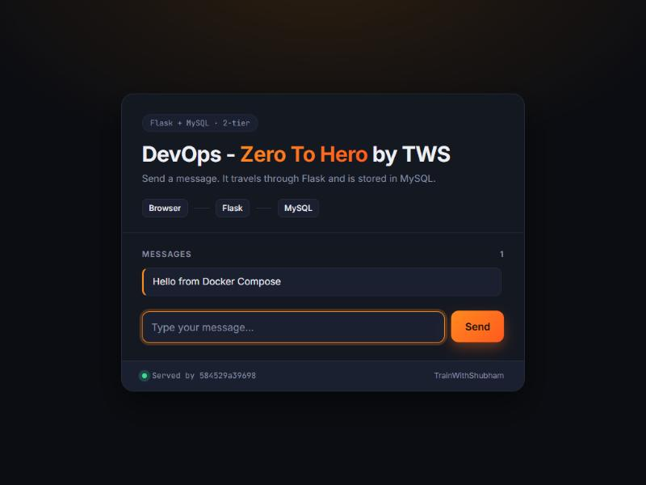
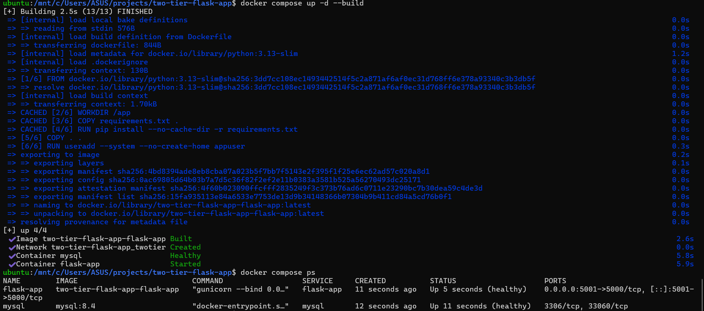
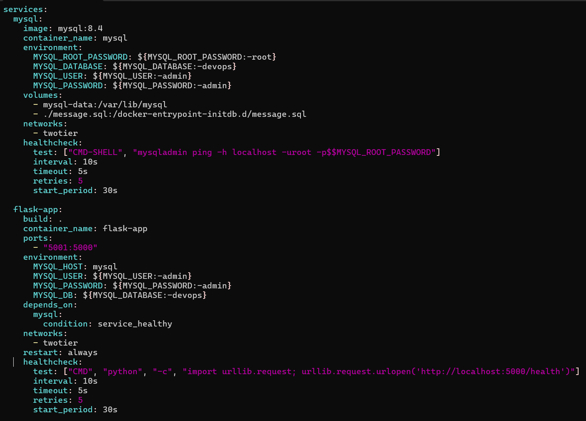
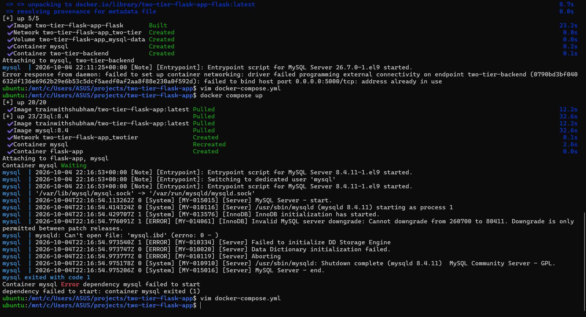

# Day 4: Docker Compose

On Days 2 and 3 I started a Flask + MySQL app with long `docker network create` and `docker run` commands. Today I replaced all of them with one [`docker-compose.yml`](docker-compose.yml) and one command.

App credit: [LondheShubham153/two-tier-flask-app](https://github.com/LondheShubham153/two-tier-flask-app) by Shubham Londhe (TrainWithShubham). Put `docker-compose.yml` in that app's folder (next to its `Dockerfile` and `message.sql`) to run it.



## Run it

```bash
docker compose up -d --build   # build my image, create network + volume, start both services
docker compose ps              # wait until both show (healthy)
docker compose logs -f flask-app
docker compose down            # stop and remove containers + network (keeps the volume)
docker compose down -v         # ...and delete the volume too
```

Then open http://localhost:5001.



## What's in the compose file



| Part | Why |
|---|---|
| `image: mysql:8.4` | A pinned version, not `latest`, so it can't change under me |
| `mysql-data:/var/lib/mysql` | Named volume, so data survives the container (Day 3) |
| `./message.sql:/docker-entrypoint-initdb.d/` | MySQL runs this SQL on first start to create the table |
| MySQL `healthcheck` | `mysqladmin ping` tells Compose when MySQL is really ready |
| `depends_on: condition: service_healthy` | Flask starts only after MySQL is healthy, not just started |
| `build: .` | Build Flask from my own Dockerfile |
| `ports: "5001:5000"` | Only Flask is published; MySQL stays private on the network |
| `${MYSQL_PASSWORD:-admin}` | Read from the environment or a `.env` file, with a default for local practice |
| `restart: always` | Restart Flask if it crashes or the machine reboots |

> The default passwords are for local practice only. For anything real, set them in a `.env` file that isn't committed.

## Commands vs Compose

| Before (Days 2–3) | Now |
|---|---|
| `docker network create too-tier` | `networks:` in the file |
| `docker volume create mysql-data` | `volumes:` in the file |
| `docker run -d --name mysql --network ... -v ... -e ... mysql` | `services: mysql:` |
| `docker run -d -p ... --network ... -e ... two-tier-backend` | `services: flask-app:` |
| Start them in the right order yourself | `depends_on` + healthchecks |

## What went wrong, and how I fixed it



| Problem | Cause | Fix |
|---|---|---|
| `invalid containerPort: 3306` | I wrote `"3306: 3306"`; the space after the colon became part of the port | `"3306:3306"` (and MySQL doesn't need a published port at all) |
| Port mapping wouldn't parse | I'd copied `"5ØØØ:5ØØØ"`: the letter Ø, not the digit 0 | Type config by hand instead of copying from videos or images |
| `Cannot downgrade from 260700 to 80411` | First run used `mysql` (= `latest`, MySQL 26.7). I then switched to `mysql:8.4`, but the volume still held data written by 26.7 | `docker compose down -v` to delete that volume, then `up` again |
| `the attribute version is obsolete` | Old Compose files start with `version: "3.8"`; it's no longer used | Delete the line |
| Compose pulled `trainwithshubham/two-tier-flask-app` instead of building my code | I had both `build:` and `image:` | Keep only `build: .` |
| `Found orphan containers (two-tier-backend)` | I renamed the service, so the old container no longer matched the file | `docker compose down --remove-orphans` |
| `port 5000 ... address already in use`, but `docker ps` was empty | Installing `docker-compose-v2` with apt also installed `docker.io`, a second Docker Engine inside Ubuntu. My old Day 2 container was still running on Docker Desktop's engine, which Ubuntu's `docker ps` couldn't see | Use port 5001 for now; long term, use only one engine |
| vim: `Found a swap file ... STILL RUNNING` | I'd pressed Ctrl+Z, which pauses vim in the background instead of closing it | `jobs`, then `fg`, then `:q!` |

## Lessons

1. Compose turns a page of commands into one readable, version-controlled file.
2. Pin image versions; `latest` can change under you.
3. Healthchecks plus `depends_on: condition: service_healthy` fix "the app started before the database" problems.
4. Volumes outlive containers, so changing the image doesn't reset the data.
5. When `docker ps` and an error disagree, check which Docker engine you're talking to (`docker context ls`, `docker info`).
