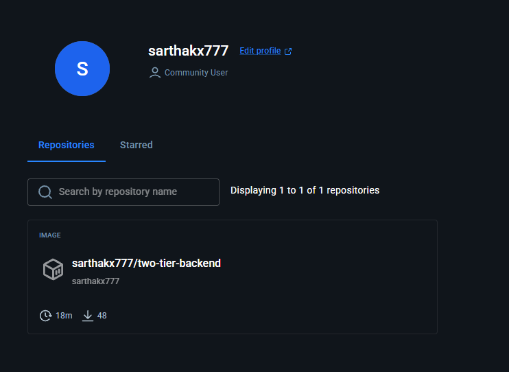
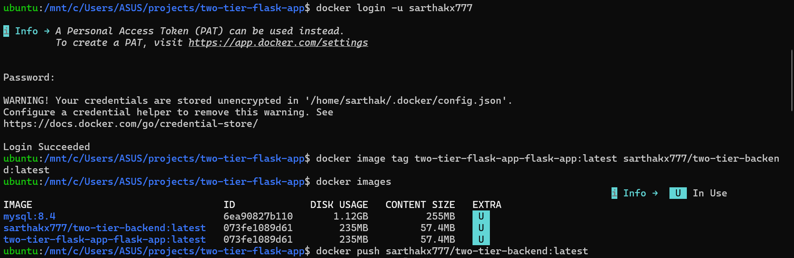
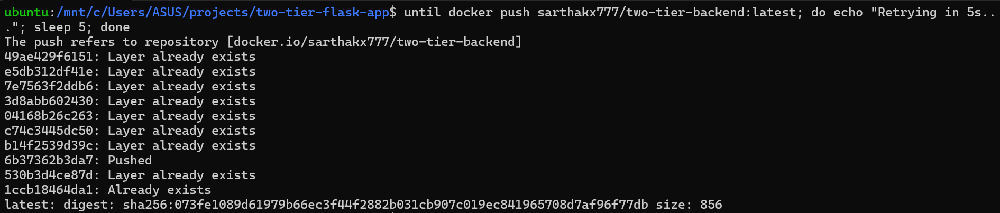
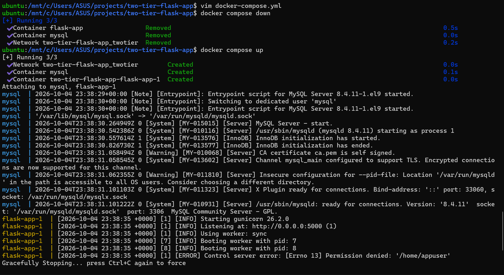
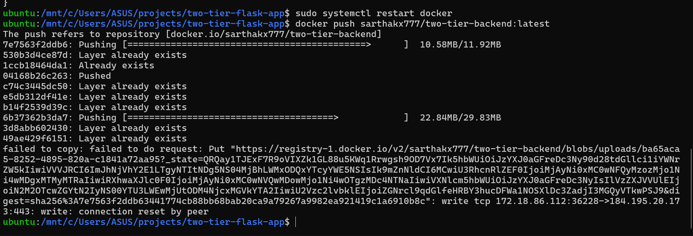

# Day 5: Docker Hub and registries

Until today my Flask image only existed on my laptop. Today I pushed it to Docker Hub, so any machine (another laptop, an EC2 server, a CI pipeline) can run it with `docker pull` instead of building it.

Image: [`sarthakx777/two-tier-backend`](https://hub.docker.com/r/sarthakx777/two-tier-backend)

App credit: [LondheShubham153/two-tier-flask-app](https://github.com/LondheShubham153/two-tier-flask-app) by Shubham Londhe (TrainWithShubham).



## Commands

```bash
# 1. Log in (use an access token, not your password)
docker login -u sarthakx777          # paste the token at the Password prompt

# 2. Give the local image a name under my Docker Hub account
docker image tag two-tier-flask-app-flask-app:latest sarthakx777/two-tier-backend:latest

# 3. Push it
docker push sarthakx777/two-tier-backend:latest
```

Next step: also push a version tag, so there's a fixed version to run instead of `latest`:

```bash
docker tag sarthakx777/two-tier-backend:latest sarthakx777/two-tier-backend:v1
docker push sarthakx777/two-tier-backend:v1   # instant: every layer already exists
```





## Running it from Docker Hub instead of building

In `docker-compose.yml`, the Flask service changed from

```yaml
build: .
```

to

```yaml
image: sarthakx777/two-tier-backend:latest
```

See [`docker-compose.yml`](docker-compose.yml).

```bash
docker compose down
docker compose up -d
```

To prove it downloads from Docker Hub, delete the local copies first. `up` then says `Pulled` instead of using the local image:

```bash
docker rmi sarthakx777/two-tier-backend:latest two-tier-flask-app-flask-app:latest
docker compose up -d
```



## Key ideas

| Idea | What it means |
|---|---|
| Registry | A server that stores images. Docker Hub is the default; others include AWS ECR and GitHub Container Registry |
| Repository | One image's home on the registry, e.g. `sarthakx777/two-tier-backend` |
| Tag | A version label, e.g. `:v1`. `:latest` is just a tag name and can point to anything |
| `docker tag` | Adds another name to an existing image. It doesn't copy anything (same image ID) |
| Layers | Images upload in layers; a layer that already exists on the registry is skipped |
| Pull policy | Compose only pulls if the image isn't already on the machine. Use `docker compose pull` to force a fresh download |

## What went wrong, and how I fixed it



| Problem | Cause | Fix |
|---|---|---|
| `docker login` succeeded without asking for a token | Plain `docker login` uses browser login, and Docker Hub created an access token automatically | Use `docker login -u <user>` and paste a token I created, with Read & Write access and an expiry date |
| `WARNING! Your credentials are stored unencrypted` | Without Docker Desktop there's no secure credential store, so the token is saved base64-encoded in `~/.docker/config.json`. Base64 is not encryption | Never share or commit that file; a credential helper like `pass` stores it encrypted |
| `docker push` failed repeatedly with `write: connection reset by peer` | The network kept cutting off the larger layers (11–30 MB) part-way through uploading | Retried with a loop (below); each attempt keeps finished layers. Lowering the WSL network MTU (`sudo ip link set dev eth0 mtu 1400`) is the next thing to try if it keeps failing |
| `max-concurrent-uploads: 1` in `daemon.json` seemed to do nothing | Docker 29 uses the containerd image store, which can ignore that setting | Rely on the retry loop instead |
| `docker compose up` didn't show `Pulled` | The image was still on my laptop, so Compose used the local copy | Remove the local image first, or run `docker compose pull` |
| The container name changed to `two-tier-flask-app-flask-app-1` | I deleted `container_name` along with `build:` | Compose names containers `<project>-<service>-<n>` unless you set `container_name` |

The retry loop:

```bash
until docker push sarthakx777/two-tier-backend:latest; do echo "Retrying in 5s..."; sleep 5; done
```

Each attempt keeps the layers that already finished, so it gets a little further every time.

## Lessons

1. A registry turns "works on my machine" into "runs on any machine": build once, pull anywhere.
2. Push a version tag (`v1`), not just `latest`, and run that exact tag.
3. Use access tokens with limited permissions and an expiry date, never your password.
4. Base64 is not encryption.
5. `until <command>; do ...; done` is a simple, useful way to retry flaky network operations.
