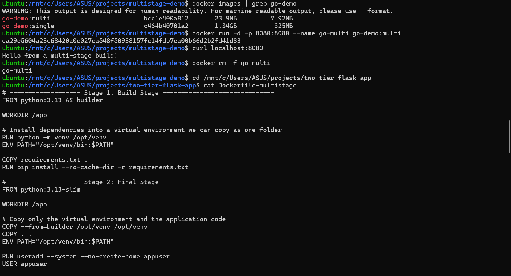
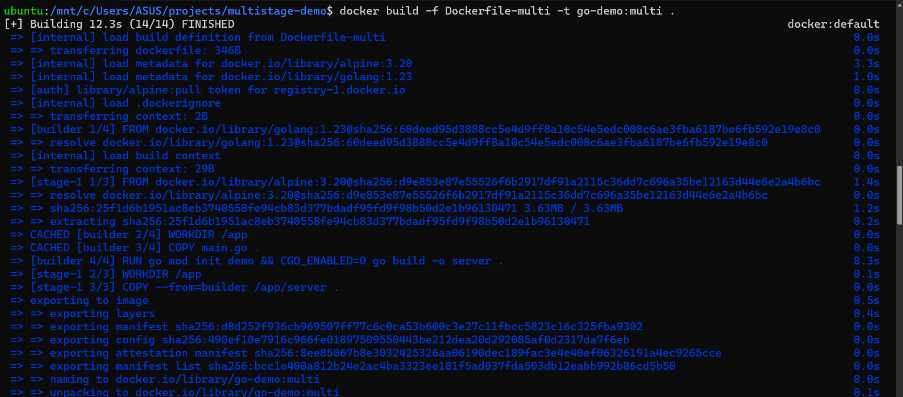
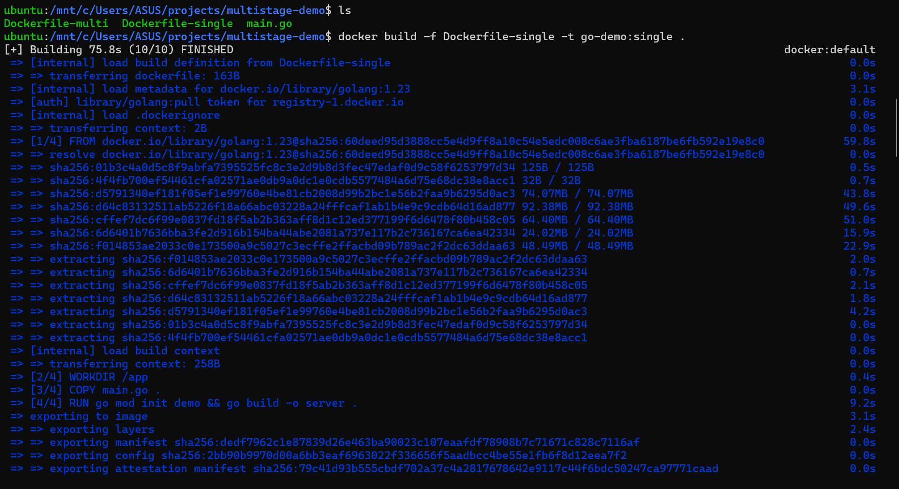
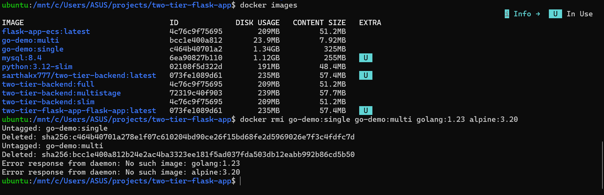
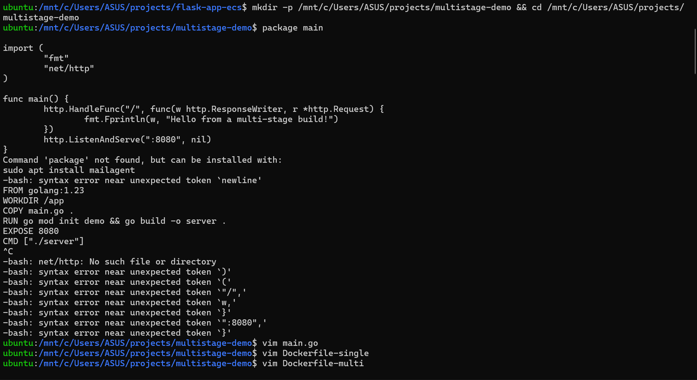

# Day 6: Multi-stage builds

**Building** an app often needs heavy tools (compilers, SDKs) that **running** it doesn't. A normal Dockerfile ships both. A multi-stage Dockerfile builds in one stage and copies only the result into a small final image.



## Results

| App | Single-stage | Multi-stage |
|---|---|---|
| Go web server ([`go-demo/`](go-demo/)) | **1.34 GB** (325 MB compressed) | **23.9 MB** (7.92 MB compressed): about 56x smaller |
| Flask + MySQL backend ([`flask-app/`](flask-app/)) | **235 MB** (57.4 MB compressed) | **239 MB** (57.7 MB compressed): slightly bigger |

## How it works

```dockerfile
# Stage 1: build, with the full Go toolchain
FROM golang:1.23 AS builder
WORKDIR /app
COPY main.go .
RUN go mod init demo && CGO_ENABLED=0 go build -o server .

# Stage 2: run, with tiny Alpine Linux and no compiler
FROM alpine:3.20
WORKDIR /app
COPY --from=builder /app/server .
EXPOSE 8080
CMD ["./server"]
```

1. Each `FROM` starts a new stage. `AS builder` names it.
2. `COPY --from=builder` copies files out of an earlier stage.
3. **Only the last stage becomes the image.** Everything else is thrown away.

`CGO_ENABLED=0` makes Go build a fully self-contained binary, so it runs on Alpine without extra libraries.

The BuildKit output labels each stage (`[builder 4/4]`, `[stage-1 3/3] COPY --from=builder`):



The single-stage build spends most of its time downloading the 300+ MB Go image, all of which ends up in the final image:



## Run it

```bash
cd go-demo
docker build -f Dockerfile-single -t go-demo:single .
docker build -f Dockerfile-multi  -t go-demo:multi .
docker images | grep go-demo

docker run -d -p 8080:8080 --name go-multi go-demo:multi
curl localhost:8080        # Hello from a multi-stage build!
docker rm -f go-multi
```

## Why multi-stage didn't help the Flask app



| | Go app | Flask app |
|---|---|---|
| Build stage needs | The Go compiler (~800 MB) | `pip install` of ready-made packages |
| Runtime needs | One compiled file | Python plus the installed packages |
| What multi-stage throws away | Almost everything | Almost nothing; the single-stage image already used `python:3.13-slim` |

Flask, gunicorn, PyMySQL and cryptography all install as pre-built packages, so the slim image never needed compilers. The multi-stage version copies a virtual environment (which includes its own pip), so it ends up a few MB bigger.

Multi-stage builds help most when the build needs heavy tools: Go, Java, Rust, frontend builds with `node_modules`, or Python packages compiled from C source.

## What went wrong, and how I fixed it



| Problem | Cause | Fix |
|---|---|---|
| `Command 'package' not found`, then a pile of syntax errors | I pasted Go source code into the terminal instead of a file | Create files with vim, or a heredoc: `cat > main.go <<'EOF' ... EOF` |
| `Dockerfile-multistage: no such file or directory` | I was in the Day 1 project folder (`flask-app-ecs`), not `two-tier-flask-app` | Check the prompt before running anything |
| Two "different" images with the same image ID | My `sed` replaced `python:3.13-slim`, but that Dockerfile used `3.12-slim`, so nothing changed and both builds were identical | `diff` the files after `sed`; `sed` doesn't warn when nothing matches |
| `The legacy builder is deprecated` | Ubuntu's `docker.io` package doesn't include BuildKit | `sudo apt install docker-buildx` |
| `docker rmi golang:1.23` says `No such image` | BuildKit keeps base images in its build cache, not as named images | `docker builder prune` |

## Lessons

1. Each `FROM` starts a new stage; only the last one ships.
2. `COPY --from=<stage>` takes just the files you need.
3. Smaller images mean faster pushes and deploys, and fewer tools for an attacker to use.
4. Measure before you optimise: multi-stage made the Go image 56x smaller, but didn't help the Flask image.
