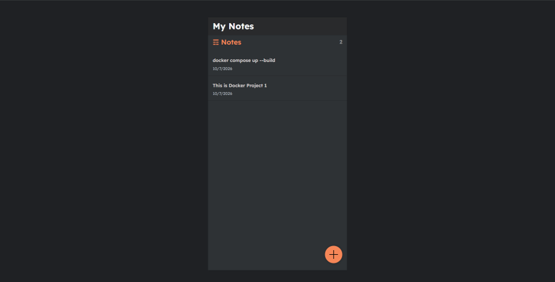
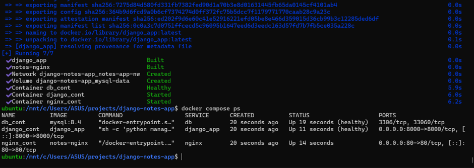
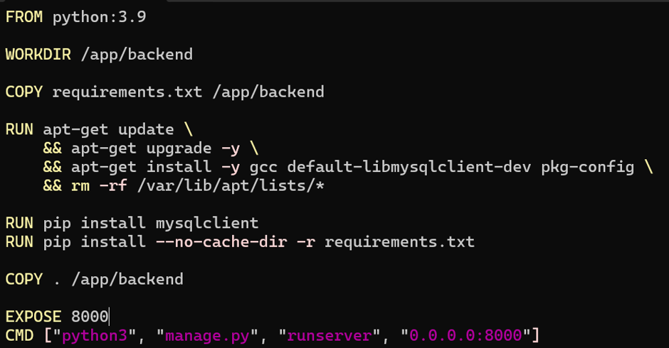
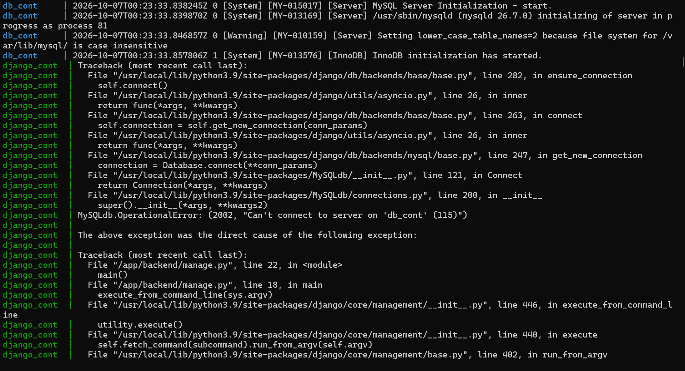
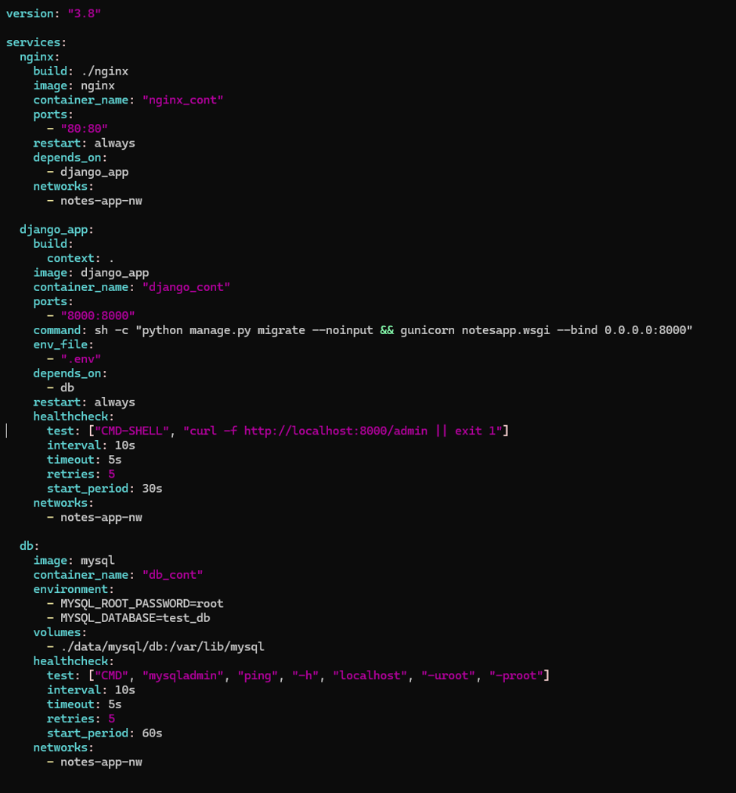
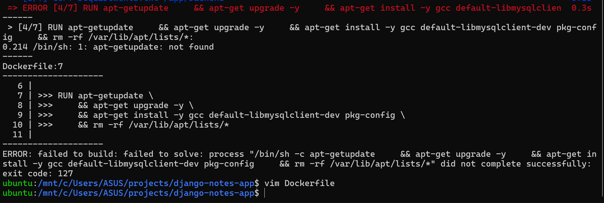

# Day 7: Project 1, Django + Nginx + MySQL with Docker Compose

My first full project: a Django notes app behind an Nginx reverse proxy, with MySQL for storage, all started with one `docker compose up`.

App credit: [LondheShubham153/django-notes-app](https://github.com/LondheShubham153/django-notes-app) by Shubham Londhe (TrainWithShubham). The Docker files in this folder are mine; clone his repo for the app code.



## Architecture

```
Browser ──► Nginx :80 ──► Django (gunicorn) :8000 ──► MySQL :3306
           (published)                                  (internal only, named volume)
            └──────────────── network: notes-app-nw ─────────────────┘
```

| Service | Image | Role |
|---|---|---|
| `nginx` | Built from [`nginx/`](nginx/) (`nginx:1.23.3-alpine` + [`default.conf`](nginx/default.conf)) | Reverse proxy: the only entry point, forwards requests to Django |
| `django_app` | Built from [`Dockerfile`](Dockerfile) | Runs migrations, then serves the app with gunicorn |
| `db` | `mysql:8.4` | Stores the notes in the `mysql-data` volume |

## Run it

```bash
git clone https://github.com/LondheShubham153/django-notes-app.git
cd django-notes-app
# copy in this folder's Dockerfile, docker-compose.yml, nginx/ and .env.example
cp .env.example .env          # then set your own password
docker compose up -d --build
docker compose ps             # wait until db and django are (healthy)
```

Open http://localhost.



## How the pieces fit

- **Startup order:** `db` has a `mysqladmin ping` healthcheck, and `django_app` uses `depends_on: db: condition: service_healthy`, so Django only starts once MySQL accepts connections.
- **Migrations:** the Django container runs `python manage.py migrate --noinput && gunicorn ...`, so the database tables are created on every start before the server comes up.
- **Configuration:** Django reads `DB_NAME`, `DB_USER`, `DB_PASSWORD`, `DB_HOST` and `DB_PORT` from the environment ([`.env.example`](.env.example)). `DB_HOST` is the MySQL container's name, which Docker's DNS resolves on the shared network.
- **Reverse proxy:** Nginx listens on port 80 and `proxy_pass`es to `django_cont:8000`, passing on the original host and client IP headers.
- **Build tools:** `mysqlclient` is compiled during `pip install`, so the Dockerfile installs `gcc`, `default-libmysqlclient-dev` and `pkg-config` first.



## What went wrong, and how I fixed it



| Problem | Cause | Fix |
|---|---|---|
| `/bin/sh: apt-getupdate: not found` (exit code 127) | Missing space: `apt-getupdate` | `apt-get update`. Exit code 127 means "command not found" |
| `no such option: --no--cache-dir` (exit code 2) | Extra dash | `--no-cache-dir`. Exit code 2 means "wrong usage" |
| `Can't connect to server on 'db_cont' (115)` | `depends_on: - db` only waits for the container to **start**; MySQL was still initialising | `depends_on: db: condition: service_healthy` |
| MySQL started as version 26.7 | `image: mysql` means `latest` | Pin `mysql:8.4` |
| `lower_case_table_names=2 because file system ... is case insensitive` | A bind mount on the Windows drive (`./data` under `/mnt/c`) | A named volume (`mysql-data`) |
| My Nginx image was named `nginx` | `build:` plus `image: nginx` tags the build as `nginx`, hiding the official image | `image: notes-nginx` |
| `service "django_app" refers to undefined network notes-app-nw` | Networks used by name must be declared at the top level | Added `networks: notes-app-nw:` at the bottom |
| vim kept disappearing, or opened a strange `[Command Line]` window | Ctrl+Z pauses vim (bring it back with `fg`); `q:` instead of `:q` opens vim's command history | `fg`, Ctrl+C, then `:wq` |

My first compose file, before the fixes:





## Still to do (next steps)

- Remove the published `8000:8000` port so only Nginx is reachable from outside
- Add a `.dockerignore` so `.env` and `db.sqlite3` aren't copied into the image
- Move the MySQL password out of `docker-compose.yml` into `.env`
- Turn off `DEBUG` and read `SECRET_KEY` from the environment
- Multi-stage Dockerfile: build `mysqlclient` with `gcc` in stage 1, ship without compilers in stage 2

## Lessons

1. `depends_on` alone isn't enough; wait for `service_healthy`.
2. Pin image versions (`mysql:8.4`), never `latest`.
3. Keep database data in named volumes, not on the Windows drive.
4. Only the reverse proxy should be published; everything else stays on the internal network.
5. Read the exit code: 127 = command not found, 2 = wrong usage.
