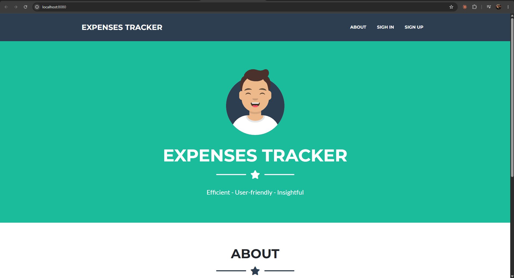
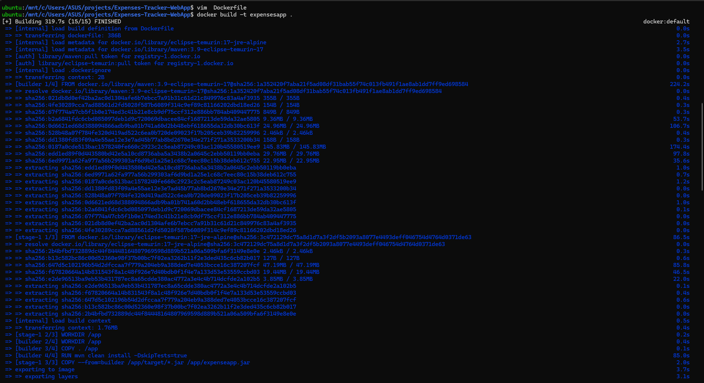
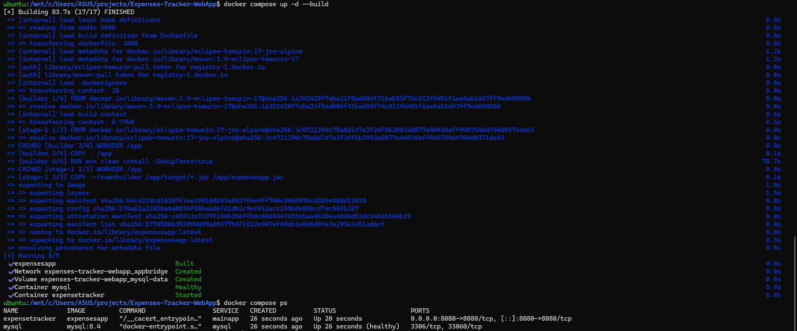
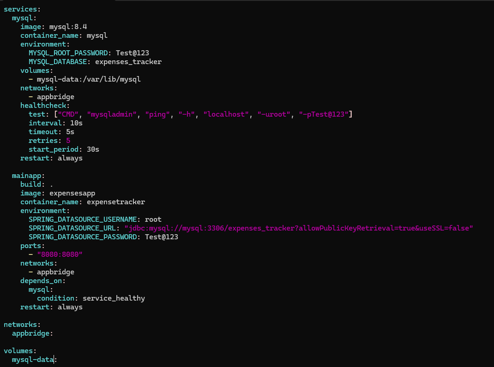
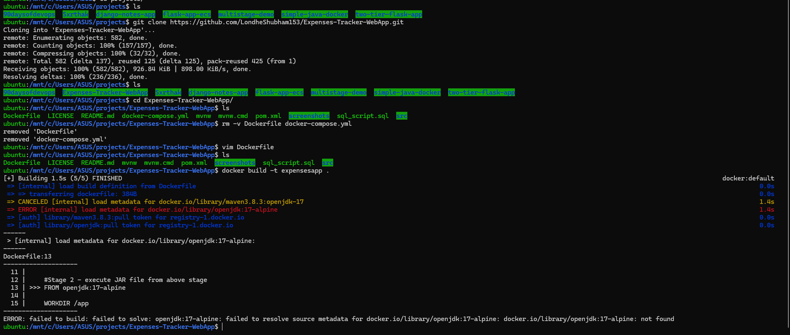

# Day 8: Project 2, Spring Boot Expenses Tracker + MySQL

A Java Spring Boot web app and a MySQL database, built with a **multi-stage Dockerfile** (Maven + JDK to build, JRE only to run) and started with Docker Compose.

App credit: [LondheShubham153/Expenses-Tracker-WebApp](https://github.com/LondheShubham153/Expenses-Tracker-WebApp) by Shubham Londhe (TrainWithShubham). I deleted the repo's own `Dockerfile` and `docker-compose.yml` and wrote these two myself.



## Architecture

```
Browser ──► mainapp (Spring Boot) :8080 ──► mysql :3306
            (published)                     (internal only, named volume)
            └────────────── network: appbridge ──────────────┘
```

## The multi-stage Dockerfile

```dockerfile
# Stage 1: build the JAR with Maven and the full JDK
FROM maven:3.9-eclipse-temurin-17 AS builder
WORKDIR /app
COPY . /app
RUN mvn clean install -DskipTests=true

# Stage 2: run it with only the Java runtime (JRE) on Alpine
FROM eclipse-temurin:17-jre-alpine
WORKDIR /app
COPY --from=builder /app/target/*.jar /app/expenseapp.jar
CMD ["java", "-jar", "expenseapp.jar"]
```

This is the case where multi-stage really pays off (unlike my Flask app on [Day 6](../day-06-multi-stage-builds/)): Maven, the JDK and the downloaded dependencies stay in stage 1. The final image only contains the JRE and one `.jar` file.



## Run it

```bash
git clone https://github.com/LondheShubham153/Expenses-Tracker-WebApp.git
cd Expenses-Tracker-WebApp
# replace the repo's Dockerfile and docker-compose.yml with the ones in this folder
docker compose up -d --build
docker compose ps        # wait for mysql (healthy) and the app to start, about a minute
```

Then open port 8080 in your browser.



## How the pieces fit

- **Database settings:** the Spring Boot app reads `SPRING_DATASOURCE_URL`, `_USERNAME` and `_PASSWORD` from the environment. These override the defaults in `application.properties`.
- **Tables:** `spring.jpa.hibernate.ddl-auto=update` makes Hibernate create the tables on startup, so `sql_script.sql` isn't needed.
- **`allowPublicKeyRetrieval=true`** in the JDBC URL: MySQL 8's default login method needs it when SSL is off, otherwise the app fails with `Public Key Retrieval is not allowed`.
- **Startup order:** `depends_on: mysql: condition: service_healthy`, with a `mysqladmin ping` healthcheck on MySQL.



> The password in `docker-compose.yml` is the app's default practice password from the original repo. For anything real, move it to a `.env` file that isn't committed.

## What went wrong, and how I fixed it



| Problem | Cause | Fix |
|---|---|---|
| `openjdk:17-alpine: not found` | The official `openjdk` images on Docker Hub are deprecated and their old tags removed | `eclipse-temurin:17-jre-alpine` |
| Stage 1 would fail too: `maven3.8.3:openjdk-17` | Missing `:` (image is `maven`, version goes in the tag) and a deprecated `openjdk` variant | `maven:3.9-eclipse-temurin-17` |
| `-Dskiptests=true` is silently ignored | Maven options are case-sensitive, so the tests still ran | `-DskipTests=true` |
| The compose file I started from used `image: snehcreate/expensetracker_v3` | Someone else's ready-made image; my Dockerfile would never be used | `build: .` + `image: expensesapp` |
| `mysql:latest` and `./mysql-data` | Unpinned version, and a bind mount on the Windows drive (`./` makes it a bind mount even though a named volume was declared) | `mysql:8.4` and `mysql-data:` (named volume) |
| `depends_on: - mysql` | Only waits for the container to start, not for MySQL to be ready | `condition: service_healthy` |

## Lessons

1. Multi-stage builds shine for compiled languages: build tools in stage 1, runtime only in stage 2.
2. Base images get deprecated. When a tutorial's `FROM` line fails with `not found`, check Docker Hub for the current replacement.
3. Read every line of a compose file you didn't write. One `image:` line can silently replace your own build with someone else's image.
4. Flags are case-sensitive: `-DskipTests`, not `-Dskiptests`.
