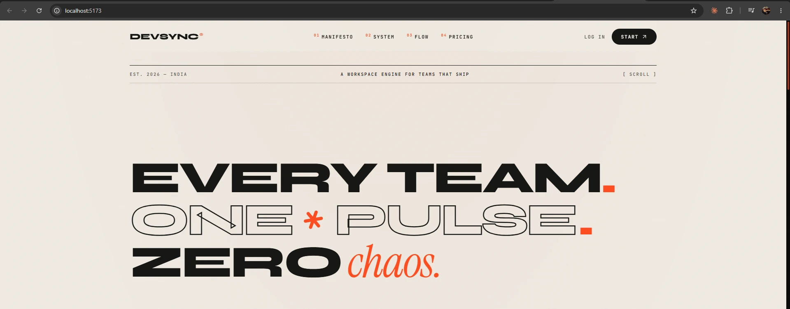
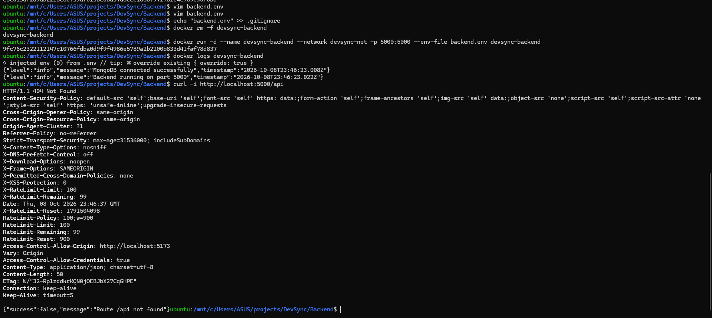

# Day 9: Project 3, Dockerising a MERN app (DevSync)

DevSync is a real-time team collaboration platform (Kanban boards, team chat, notifications) built with **MongoDB, Express, React and Node.js**, with **Socket.IO** for live updates. The repo had no Docker setup, so I wrote one: two Dockerfiles, an Nginx config and a compose file.

App credit: [RealAbhinav001/DevSync](https://github.com/RealAbhinav001/DevSync) by Abhinav Chaubey. Everything in this folder is my Docker setup; clone his repo for the app code.



## Architecture

```
Browser ──► frontend (Nginx, React build) :5173 → 80
   │
   └──────► backend (Node + Express + Socket.IO) :5000 ──► mongo :27017
                                                            (internal only, named volume)
            └──────────────────── network: devsync-net ────────────────────┘
```

The React app runs **in the browser**, so the browser calls the backend directly on port 5000. That's why the backend publishes a port, while MongoDB doesn't.

## Files

| File | What it does |
|---|---|
| [`Backend/Dockerfile`](Backend/Dockerfile) | `node:22-alpine`, `npm ci --omit=dev`, runs as the non-root `node` user, `CMD ["node", "src/server.js"]` |
| [`Backend/.dockerignore`](Backend/.dockerignore) | Keeps `node_modules`, tests and **all env files** out of the image |
| [`Backend/backend.env.example`](Backend/backend.env.example) | The environment variables the backend needs (with placeholder values) |
| [`Frontend/Dockerfile`](Frontend/Dockerfile) | Multi-stage: Node builds the React app, Nginx serves the static `dist/` files |
| [`Frontend/nginx.conf`](Frontend/nginx.conf) | Serves the build, with `try_files ... /index.html` so React Router pages survive a refresh |
| [`docker-compose.yml`](docker-compose.yml) | MongoDB 7 with a healthcheck and volume, plus both services built from their folders |

## Run it

```bash
git clone https://github.com/RealAbhinav001/DevSync.git
cd DevSync
# copy in this folder's docker-compose.yml, Backend/* and Frontend/* files

cp Backend/backend.env.example Backend/backend.env
# set ACCESS_KEY and REFRESH_KEY to random values: openssl rand -hex 32

docker compose up -d --build
docker compose ps        # wait until devsync-mongo is (healthy)
```

Then open port 5173 in your browser, register a user and log in.

## Key ideas

**1. Vite bakes environment variables in at build time.** `import.meta.env.VITE_API_URL` is replaced with the real URL during `npm run build`. Setting it when the container *runs* does nothing, so it's a build argument:

```dockerfile
ARG VITE_API_URL
ENV VITE_API_URL=$VITE_API_URL
RUN npm run build
```

```yaml
frontend:
  build:
    context: ./Frontend
    args:
      VITE_API_URL: http://localhost:5000/api
```

**2. Single-page apps need a fallback route.** `/login` and `/dashboard` only exist inside React. Without `try_files $uri $uri/ /index.html;`, refreshing one of those pages returns a 404 from Nginx.

**3. Production-style Node image.** Dependency files are copied first for layer caching, dev dependencies are skipped, the npm cache is cleaned, and the app runs as a non-root user. `node` is PID 1 (not `npm start`), so it receives stop signals directly.

**4. MongoDB healthcheck.** `mongosh --eval "db.adminCommand('ping')"`, with `depends_on: condition: service_healthy`, so the backend only starts once MongoDB answers.



`injected env (0) from .env` shows no `.env` file made it into the image; all settings came from the env file passed at run time. The `404` JSON response proves the backend answers (`/api` itself just isn't a route). The response headers show the app's security middleware (helmet), rate limiting (100 requests per 15 minutes) and CORS restricted to the frontend's address.

## What I found along the way

| Problem | Cause | Fix |
|---|---|---|
| The backend exits with `Missing required environment variable: ACCESS_KEY` | The repo's `.env.example` lists `SECRET_KEY`, but `config.js` actually requires `ACCESS_KEY` and `REFRESH_KEY` | Read the code, not just the docs. [`backend.env.example`](Backend/backend.env.example) lists the real variables |
| `echo "backend.env" >> .gitignore` didn't work | `.gitignore` had no newline at the end, so the text was glued onto the last line: `uploads/backend.env`. Neither file was ignored any more | Check with `tail .gitignore`; put each entry on its own line |
| The secrets file was copied into the backend image | `.dockerignore` excluded `.env` but not `backend.env` | Added `backend.env` to `.dockerignore` |
| `$uri` vanished from `nginx.conf` when created with a heredoc | An unquoted `<<EOF` lets bash expand `$uri` as an (empty) variable | Use `<<'EOF'` (quoted) for files that contain `$` |

## Lessons

1. A MERN app is three containers: database, API, and a static frontend behind a web server.
2. Know when variables are read: Vite reads them at **build** time, Node at **run** time.
3. Keep secrets out of images (`.dockerignore`) **and** out of Git (`.gitignore`), and check both.
4. Generate secrets with `openssl rand -hex 32`, never type them yourself.
